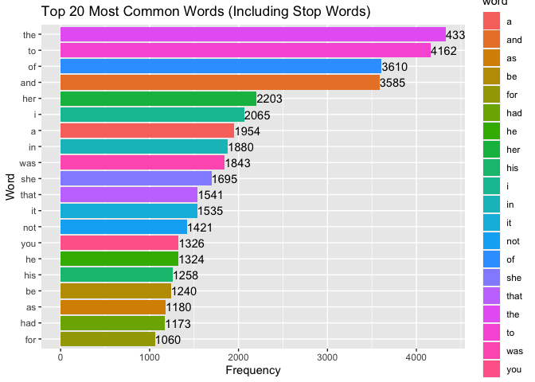
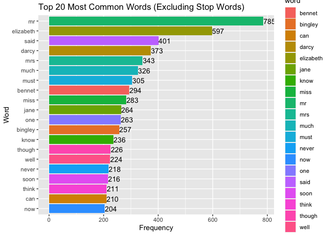

# Install packages

    # install.packages("janeaustenr")
    # install.packages("dplyr")
    # install.packages("ggplot2")
    # install.packages("tidytext")
    # install.packages("stopwords")

# Load packages

    library(janeaustenr)
    library(dplyr)

    ## 
    ## Attaching package: 'dplyr'

    ## The following objects are masked from 'package:stats':
    ## 
    ##     filter, lag

    ## The following objects are masked from 'package:base':
    ## 
    ##     intersect, setdiff, setequal, union

    library(ggplot2)
    library(tidytext)
    library(stopwords)

# Load book and apply filters to reove stopwords.

    # Load a Jane Austen book, for example "Pride and Prejudice"
    text <- tibble(txt = prideprejudice)
    stop_words = tibble(word = stopwords())
    # Convert the text to a tidy data frame
    original_text <- text %>% unnest_tokens(output = word, input = txt)
    filtered_text <- original_text %>% anti_join(stop_words, by = c("word" = "word"))

# Count the most common words for original text (with stopwords)

    # Count the most common words
    word_counts <- original_text %>%
      count(word, sort = TRUE)

    # Take the top 20 most common words for plotting
    top_words <- word_counts %>%
      top_n(20, n)

# Plot the most common words with stopwords

    # Create the plot
    ggplot(top_words, aes(x = reorder(word, n), y = n, fill = word)) +
      geom_col() +
      xlab("Word") +
      ylab("Frequency") +
      geom_text(aes(label = n), nudge_y = 0.5, hjust = 0) +
      ggtitle("Top 20 Most Common Words (Including Stop Words)") +
      coord_flip()

 \#
Count the most common words for original text (without stopwords)

    # Count the most common words
    word_counts <- filtered_text %>%
      count(word, sort = TRUE)

    # Take the top 20 most common words for plotting
    top_words <- word_counts %>%
      top_n(20, n)

# Plot the most common words without stopwords

    # Create the plot
    ggplot(top_words, aes(x = reorder(word, n), y = n, fill = word)) +
      geom_col() +
      xlab("Word") +
      ylab("Frequency") +
      geom_text(aes(label = n), nudge_y = 0.5, hjust = 0) +
      ggtitle("Top 20 Most Common Words (Excluding Stop Words)") +
      coord_flip()

